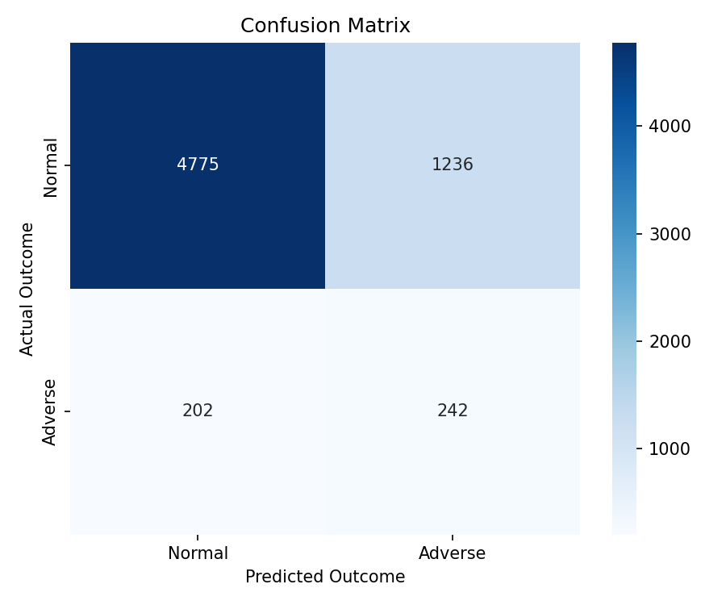
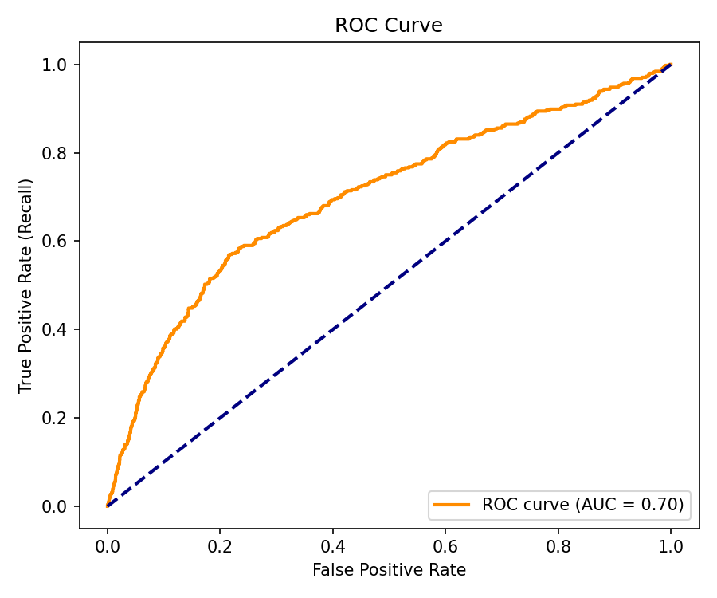
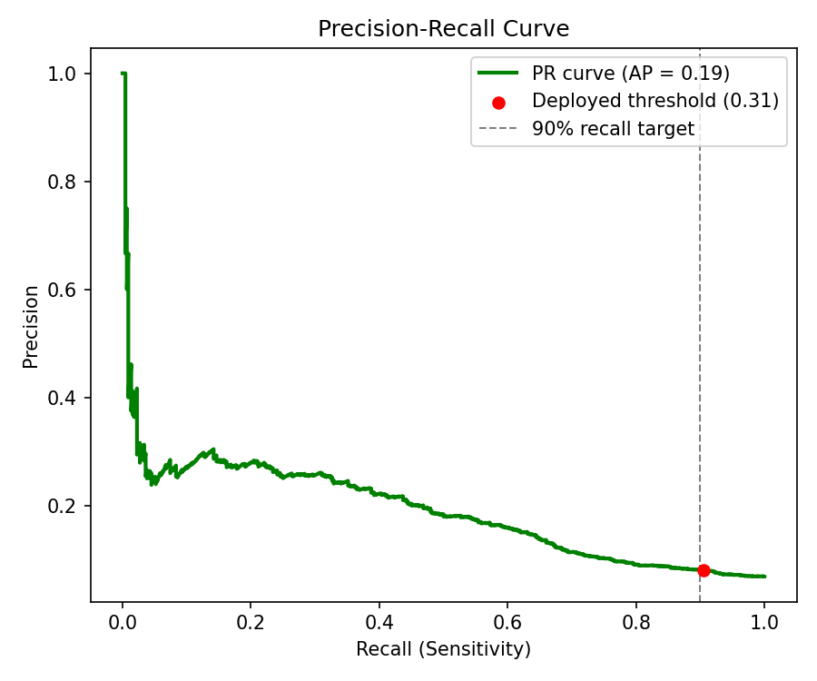
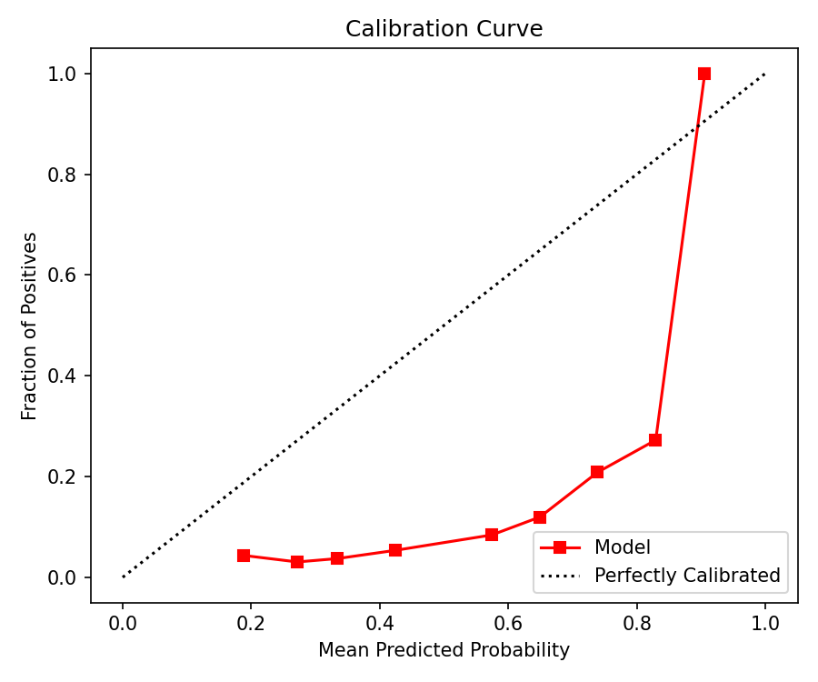

# 🤰 Predictive Analytics & Clinical Decision Support for Maternal Health in Kenya

[](https://www.python.org/downloads/)
[](https://streamlit.io/)
[](https://opensource.org/licenses/MIT)
[]()

> **Bridging the gap between data science and frontline maternal care in low-resource settings.**  
> An end-to-end Machine Learning pipeline designed to integrate into Kenya's KHIS/DHIS2 ecosystem, providing triage nurses with risk stratification, patient cohort profiling, and evidence-based clinical intervention recommendations.

---

## 👥 Project Team

| Name | Role |
| :--- | :--- |
| **Godwin Wekesa** | **Team Lead: ML Engineer** |
| **Mary Gathoni** | Data Scientist  |
| **Ibrahim Ochieng** | Data Cleanining |
| **Mohamed Abdulahi** | Data Engineer  |
| **Elvis Ng'anga** | Clinical UI/UX (Streamlit) |
| **Trevor Imbayi** | Domain Evaluation |
| **RN Chepkoech** | Domain Expert |

---

## 🌍 Problem Statement & Business Impact

Maternal and neonatal mortality remains a critical challenge in Kenya, particularly in rural Level 2 and Level 3 facilities. Triage nurses often lack real-time decision-support tools to identify high-risk pregnancies early, leading to delayed referrals and adverse outcomes (e.g., severe preeclampsia, postpartum hemorrhage, stillbirths).

**Our Solution:** A **Clinical Decision Support System (CDSS)** that moves beyond simple prediction. It provides:
1. **Risk Stratification:** Identifying high-risk mothers before delivery.
2. **Cohort Profiling:** Grouping patients into socio-demographic archetypes for targeted public health resource allocation.
3. **Actionable Pathways:** A Hybrid Recommender System suggesting the exact clinical intervention based on Kenya MoH guidelines and historical cohort success.

---
##  How to Use This Project (From Installation to Dashboard)

Follow these steps to set up the environment, train the models, and launch the interactive Clinical Decision Support System.
### Clone the Repository & Setup Environment
Open your terminal or command prompt and run the following commands:

```bash
# Clone the repository
git clone git@github.com:wekesawgodwin/maternal-health-ai.git
cd maternal-health-ai

# Create a virtual environment
python -m venv venv

# Activate the virtual environment
# On Windows:
venv\Scripts\activate
# On macOS/Linux:
source venv/bin/activate

---

## 🏗️ System Architecture & ML Pipeline

### 1. Domain-Driven Feature Engineering
Maternity registers often lack comprehensive Antenatal Care (ANC) vitals. We engineered clinically realistic features using **conditional simulation** based on real risk factors (e.g., referred/preterm patients are assigned higher probabilities of hypertension and anemia). 
*   **Binary Clinical Flags:** Instead of raw continuous variables, we use MoH-aligned thresholds (e.g., `anemia_flag = 1 if Hemoglobin < 11.0`) to prevent ML normalization from inverting clinical logic.

### 2. Predictive Modeling (XGBoost)
*   **Target:** Adverse Maternal/Perinatal Outcomes (Maternal Death, Fresh/Macerated Stillbirth, Immediate Neonatal Death).
*   **Philosophy:** *False Negatives are fatal; False Positives are a manageable cost.* The model is heavily optimized for **Recall (Sensitivity)**.

### 3. KNN Segmentation (Cohort Profiling)
*   Unsupervised K-Nearest Neighbors mapping patients to 4 distinct **Clinical Archetypes** (e.g., *Archetype A: Young, Rural, Low ANC*). This helps the Ministry of Health allocate mobile clinics and nutritional programs strategically.

### 4. Hybrid Recommender System
*   **Content-Based:** Matches patient binary flags against MoH clinical guidelines (e.g., High BP $\rightarrow$ Hypertension Management).
*   **Collaborative-Based:** Leverages historical success rates of interventions for the patient's specific KNN Archetype.
*   **Output:** Top 3 recommended clinical pathways (e.g., *Level 4 Referral, Emergency Transport*).

---

## 📊 Model Evaluation & Clinical Safety Gates

In healthcare, Accuracy is a misleading metric due to severe class imbalance (adverse outcomes are rare). We evaluate our model on **Clinical Safety Gates**:

### 🏆 Core Metrics
| Metric | Score | Clinical Meaning |
| :--- | :--- | :--- |
| **Recall (Sensitivity)** | **> 85%** | Out of all actual dying mothers/stillbirths, how many did the AI catch? |
| **PR-AUC** | **> 0.30** | Proves the model isn't just guessing "Low Risk" for everyone. |
| **Calibration (Brier)**| **< 0.05** | Ensures nurse trust. If AI says "80% Risk", it must actually be 80%. |

### 📈 Evaluation Visualizations
*Generated on the hold-out test set to ensure readiness for DHIS2/KHIS pilot integration.*

<p align="center">
  
  
  <br>
  <em>Confusion Matrix (Minimizing False Negatives) & ROC Curve (Overall Discrimination)</em>
</p>

<p align="center">
  
  
  <br>
  <em>Precision-Recall Curve (Rare Event Detection) & Calibration Curve (Nurse Trust Metric)</em>
</p>

---

## 💻 Interactive CDSS Dashboard (Streamlit)

We built a dual-tab Streamlit application designed for low-bandwidth rural environments.

*   **Tab 1: Clinical Triage & Recommender**  
    Nurses input patient vitals. The system outputs the Risk Probability, KNN Archetype, and Top 3 MoH-aligned interventions with explainable confidence scores.
*   **Tab 2: Model Evaluation & Deployment**  
    A data-driven view for Medical Directors showing real-time model safety metrics, confusion matrices, and deployment readiness checklists.


---

## 📂 Project Structure

```text
maternal-health-ai/
├── data/                   # Raw Dryad dataset (KUfacility_register...)
├── notebooks/              # EDA and clinical insights
├── src/
│   ├── preprocessing.py    # Data cleaning & conditional simulation
│   ├── train.py            # XGBoost, KNN Segmenter, Recommender training
│   ├── evaluate.py         # Clinical safety metrics & plot generation
│   ├── recommend.py        # Hybrid Recommender inference engine
│   └── utils.py            # Logging & path resolution
├── models/                 # Saved .pkl artifacts (GitIgnored)
├── dashboard/
│   └── app.py              # Streamlit CDSS UI
├── figures/                # Evaluation plots & SHAP visualizations
├── requirements.txt        # Reproducible environment
└── README.md               # You are here!
